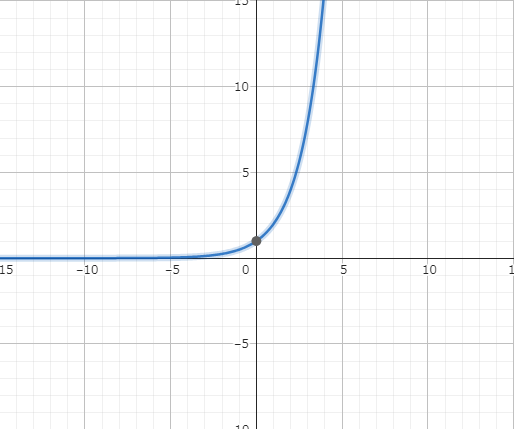
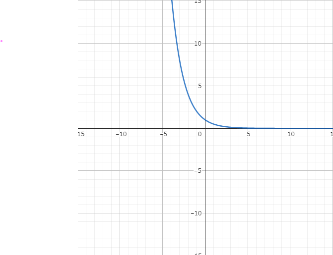
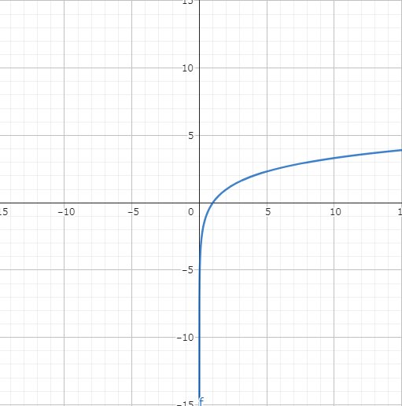
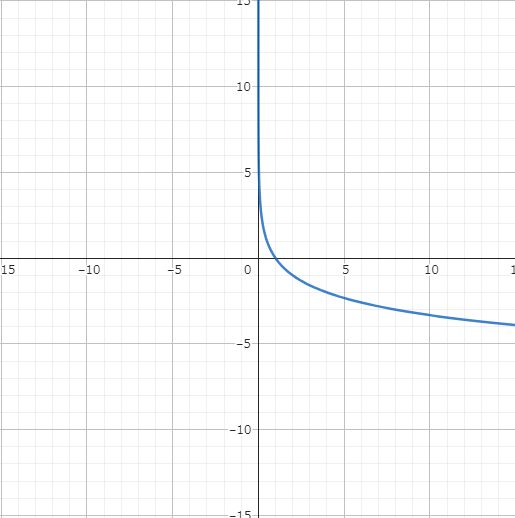

# 数学Ⅱ

## 1. 点と線
### 1.1. 内分と外分
- aとbをm:nに内分する点

$$
\frac{n \times a + m \times b}{m+n}
$$

- aとbをm:nに**外分**する点

$$
\frac{- n \times a + m \times b}{m - n}
$$

### 1.2. ２点間の距離
- (x1,y1), (x2, y2)の距離
※三平方の定理を使う

$$
AB = \sqrt{(x2-x1)^2 + (y2-y1)^2}
$$

- 内分点

$$
(\frac{n \times x1 + m \times x2}{m+n}), (\frac{n \times y1 + m \times y2}{m+n})
$$

- 外分点

$$
(\frac{-n \times x1 + m \times x2}{m-n}), (\frac{-n \times y1 + m \times y2}{m-n})
$$

### 1.3. 三角形の重心
- A(x1,y1), B(x2, y2), C(x3, y3)の重心

1. BとCの中点M(1:1に内分する座標)を求める

$$
(\frac{1 \times x2 + 1 \times x3}{1+1}), (\frac{1 \times y2 + 1 \times y3}{1+1})
$$

↓

$$
(\frac{x2 + x3}{2}), (\frac{y2 + y3}{2})
$$

2. AとMを2:1に内分する点（重心）を求める

$$
(\frac{1 \times x1 + 2 \times \frac{x2 + x3}{2}}{2+1})
$$

3. 2を計算した結果

$$
(\frac{x1 + x2 + x3}{3}), (\frac{y1 + y2 + y3}{3})
$$

### 1.4. 点と直線の方式
P(x1,y1)と直線(ax + by + c =0)の距離dは

$$
d = \frac{|a \times x1 + b \times y1 + c|}{\sqrt{a^2 + b^2}}
$$

## 2. 三角関数
### 2.1. 基本

- 単位円(半径rの)

$$
\sin{\theta} = \frac{y}{r}
$$

$$
\cos{\theta} = \frac{x}{r}
$$

$$
\tan{\theta} = \frac{x}{y}
$$

$$
\cot{\theta} = \frac{y}{x}
$$

- 変換

$$
\sin^{2}{\theta} + \cos^{2}{\theta} = 1
$$

$$
\tan{\theta} = \frac{sin{\theta}}{sin{\theta}}
$$

$$
\cot{\theta} = \frac{cos{\theta}}{sin{\theta}}
$$

$$
\tan^{2}{\theta} + 1 = \frac{1}{cos^{2}{\theta}}
$$

### 2.2. 円の方程式
$$
x^{2} + y^{2} = r^{2}
$$

### 2.3. 加法定理

#### 2.3.1. 正弦(sin)・余弦(cos)の加法定理

$$
\sin(\alpha + \beta) = \sin{\alpha} \cdot \cos{\beta} + \cos{\alpha} \cdot \sin{\beta}
$$

$$
\sin(\alpha + \beta) = \sin{\alpha} \cdot \cos{\beta} - \cos{\alpha} \cdot \sin{\beta}
$$

$$
\cos(\alpha + \beta) = \cos{\alpha} \cdot \cos{\beta} - \sin{\alpha} \cdot \sin{\beta}
$$

$$
\cos(\alpha - \beta) = \cos{\alpha} \cdot \cos{\beta} + \sin{\alpha} \cdot \sin{\beta}
$$

#### 2.3.2. 正接(tan)の加法定理

$$
\tan(\alpha + \beta) = \frac{\tan{\alpha} + \tan{\beta}}{1 - \tan{\alpha} \cdot \tan{\beta} }
$$

$$
\tan(\alpha - \beta) = \frac{\tan{\alpha} - \tan{\beta}}{1 + \tan{\alpha} \cdot \tan{\beta} }
$$

### 2.4. 倍角・半角

#### 2.4.1. ２倍角の公式

- sin2θの公式

$$
\sin{2\alpha} = 2 \cdot \sin{\alpha} \cdot \cos{\alpha}
$$

$$
\sin(\alpha + \alpha) = \sin{\alpha} \cdot \cos{\alpha} + \cos{\alpha} \cdot \sin{\alpha}
$$

- cos2θの公式

$$
\cos{2\alpha} = \cos^2{\alpha}  - \sin^2{\alpha}
$$

$$
\cos{2\alpha} = \cos^2{\alpha}  - (1 - \cos^{2}{\alpha}) = 2 \cos^{2}{\alpha} -1
$$

$$
\cos{2\alpha} = (1 - \sin^{2}{\alpha}) - \sin^2{\alpha} = 1 - 2 \sin^{2}{\alpha}
$$

$$
\cos{2\alpha} = \cos^2{\alpha}  - \sin^2{\alpha}
$$

$$
\cos(\alpha + \alpha) = \cos{\alpha} \cdot \cos{\alpha} - \sin{\alpha} \cdot \sin{\alpha}
$$

## 3. 指数・対数
### 3.1. 指数
- 公式1

$$
\sqrt[n]{a^{n}} = (\sqrt[n]{a})^{n} = a
$$

- 公式2

$$
\sqrt[n]{a^{n}} = = a^{\frac{1}{n}}
$$

- 公式3

$$
\frac{1}{a^{n}} = a^{-n} = (\frac{1}{a})^{n}
$$

- 公式4

$$
a^{r} \times a^{n} = a^{r + n}
$$

- 公式5

$$
a^{r} \div a^{n} = a^{r - n}
$$

- 公式5
指数の入れ替えが出来る

$$
(a^{r})^{n} = a^{r \times n} = (a^{n})^{r}
$$

- 公式6
指数の入れ替えが出来る

$$
(ab)^{n} = a^{n} \times b^{n}
$$

- グラフ

$$
y = 2^{x}
$$

$$
y = (\frac{1}{2})^{x}
$$

### 3.2. 対数
#### 3.2.1. 基本
- 公式1

$$
\log_{a}{a^{p}} = p
$$

- 公式2

$$
\log_{a}{a^{1}} = 1
$$

- 公式3

$$
\log_{a}{1} = 0
$$

#### 3.2.2. 基本２

$$
\log_{a}{M} + \log_{a}{N} = \log_{a}{M \times N} 
$$

$$ 
\log_{a}{M} - \log_{a}{N} = \log_{a}{\frac{M}{N}} 
$$

- 重要！！！

$$
\log_{a}{B}  = \frac{ \log_{c}{B}}{ \log_{c}{a}} 
$$

$$
\log_{a}{B}  = \frac{ \log_{B}{B}}{ \log_{B}{a}} =  \frac{1}{ \log_{B}{a}}
$$

$$
\log_{a}{B}  = \frac{ \log_{a}{B}}{ \log_{a}{a}} =  \frac{\log_{a}{B}}{ 1}
$$

- グラフ

$$
y = \log_{2}{x}
$$

$$
y = \log_{\frac{1}{2}}{x}
$$

